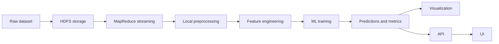

# Project Documentation Report

## Project Overview
This project implements a Big Data pipeline to process and forecast household energy consumption using Hadoop MapReduce, Python preprocessing, and machine learning models. The system ingests a large time-series dataset, aggregates it with MapReduce, engineers features for modeling, trains regression models, and produces predictions and visualizations.

Key capabilities:
- Distributed storage and processing with Hadoop (Docker)
- MapReduce streaming jobs for hourly aggregation
- Python preprocessing and feature engineering
- Model training, evaluation, and prediction
- Optional API and UI for serving results

## Architecture Diagram


## Execution Flow
1. Download the UCI household power consumption dataset.
2. Upload the dataset to HDFS (Docker Hadoop).
3. Run MapReduce streaming to compute hourly aggregates.
4. Run preprocessing to clean data and engineer monthly features.
5. Train ML models and evaluate metrics.
6. Generate next-month predictions and charts.
7. (Optional) Run FastAPI backend and the static HTML UI.

## Repository Structure
```
BDA_PROJ/
├── Docs/                                  # Detailed academic report
├── energy-consumption-prediction/         # Core project code
│   ├── api/                               # FastAPI backend
│   ├── dataset/                           # Raw dataset (not tracked)
│   ├── hadoop/                            # MapReduce scripts and Docker helpers
│   ├── ml/                                # Training, evaluation, prediction
│   ├── mongo_data/                        # MongoDB Docker volume data
│   ├── notebooks/                         # Experiments
│   ├── output/                            # Processed data and predictions
│   ├── preprocessing/                     # Cleaning and feature engineering
│   ├── ui/                                # Static HTML UI (Vite assets present)
│   ├── visualization/                     # Charts and visualization scripts
│   ├── docker-compose.yml                 # Docker services (Mongo)
│   ├── main.py                            # End-to-end pipeline runner
│   └── requirements.txt                   # Python dependencies
├── Images/                                # Output images (if any)
├── README.md                              # Root overview and quick start
└── REPORT.md                              # This document
```

## Folder and File Descriptions
### Root
- README.md: Project overview and quick start.
- REPORT.md: Full documentation.
- sample_copy.csv, sample.txt: Sample files.

### energy-consumption-prediction/
- main.py: Runs preprocessing, training, evaluation, prediction, and visualization.
- requirements.txt: Python dependencies for the pipeline.
- docker-compose.yml: Runs MongoDB service for storage.
- api/app.py: FastAPI backend for serving predictions.
- dataset/household_power_consumption.txt: Raw dataset (download separately).
- hadoop/mapper.py, hadoop/reducer.py: MapReduce streaming logic.
- hadoop/run_mapreduce.bat: Executes Hadoop streaming job.
- hadoop/upload_to_hdfs.bat: Uploads dataset to HDFS.
- hadoop/fetch_output.bat: Pulls MapReduce output to local CSV.
- preprocessing/clean_data.py: Cleans raw dataset.
- preprocessing/feature_engineering.py: Generates time-series features.
- preprocessing/preprocess_pipeline.py: Orchestrates preprocessing.
- ml/train_linear_regression.py: Baseline model training.
- ml/train_random_forest.py: Ensemble model training.
- ml/train_xgb.py: XGBoost training (if installed).
- ml/train_lstm.py: LSTM training (if installed).
- ml/evaluate_model.py: Metrics evaluation.
- ml/predict.py: Generates predictions.
- ml/saved_models/: Persisted models and scalers.
- visualization/visualization.py: Generates charts from outputs.
- output/: CSVs, metrics, and prediction results.
- ui/index.html: Static UI entry point.
- ui/src/: React/Vite UI source.

## Common Tasks and Commands
### Python Environment Setup
```bat
python -m venv .venv
.venv\Scripts\activate
pip install -r energy-consumption-prediction\requirements.txt
```

### Start Hadoop (Docker)
```bat
cd energy-consumption-prediction
docker compose up -d
```

### Install Python inside Hadoop container (one-time)
```bat
cd energy-consumption-prediction\hadoop
docker_install_python.bat
```

### Run MapReduce Pipeline
```bat
cd energy-consumption-prediction\hadoop
upload_to_hdfs.bat
run_mapreduce.bat
```

### Run Full Pipeline
```bat
cd energy-consumption-prediction
python main.py
```

### Run ML Steps Individually
```bat
python preprocessing\preprocess_pipeline.py
python ml\train_linear_regression.py
python ml\train_random_forest.py
python ml\evaluate_model.py
python ml\predict.py
python visualization\visualization.py
```

### Run API and UI
```bat
cd energy-consumption-prediction
.\venv\Scripts\python.exe -m uvicorn api.app:app --reload --port 8000
```
```bat
cd energy-consumption-prediction\ui
python -m http.server 3000
```
Open http://localhost:3000

## Dataset Notes
The dataset is not stored in the repository. Download it from the UCI repository and place it at:
```
energy-consumption-prediction\dataset\household_power_consumption.txt
```

## Outputs
- output/processed_data.csv
- output/processed_monthly.csv
- output/metrics.txt
- output/predictions.csv
- output/next_month_prediction.csv
- visualization/charts/*.png

## Technology Stack
- Hadoop HDFS, MapReduce (Docker)
- Python, pandas, numpy, scikit-learn
- Optional: XGBoost, TensorFlow/Keras
- FastAPI backend, static HTML/React UI
- MongoDB (Docker)
